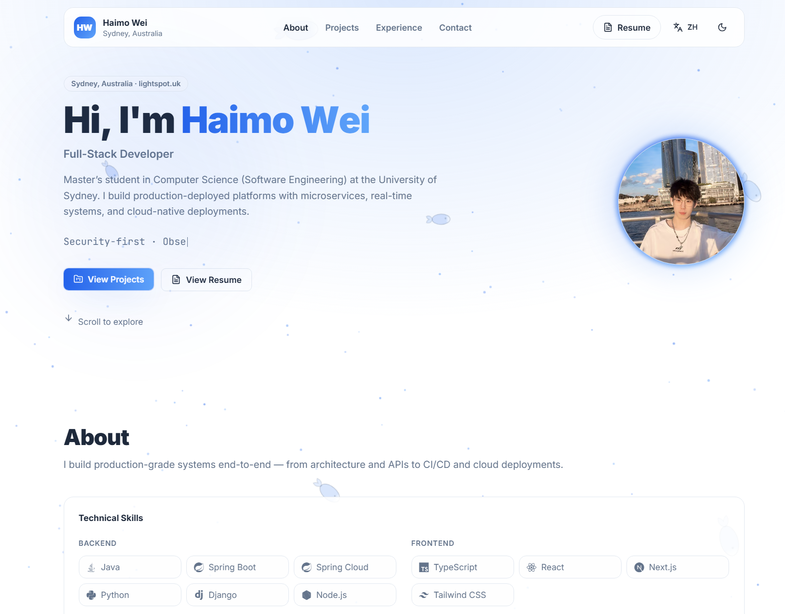

# Light-Spot

> A modern, performant personal portfolio built with Next.js 15, featuring smooth animations and bilingual support.


🔗 **Live Demo**: [https://lightspot.uk](https://lightspot.uk)



---

## Features

- ✨ **Particle Background** - Interactive tsparticles with mouse grab effect
- 🎭 **Text Animation** - Letter-by-letter spring animation on hero section
- 🃏 **3D Tilt Cards** - Perspective-based hover effects on project cards
- 🔦 **Mouse Glow** - Cursor-following ambient light effect
- 🌓 **Theme Toggle** - Dark/Light mode with smooth transitions
- 🌏 **Bilingual** - English/Chinese support via next-intl
- ♿ **Accessibility** - Reduced motion support throughout

---

## Tech Stack

| Category | Technologies |
|----------|--------------|
| **Framework** | Next.js 15 (App Router, SSG) |
| **Language** | TypeScript 5 |
| **Styling** | Tailwind CSS 3.4 |
| **Animations** | Framer Motion 11, tsparticles |
| **i18n** | next-intl |
| **Theme** | next-themes |
| **Forms** | React Hook Form + Zod |
| **Icons** | Lucide React, Devicon |

---

## Project Structure

```
light-spot/
├── src/
│   ├── app/[locale]/        # i18n routes (en, zh)
│   ├── components/
│   │   ├── layout/          # Navbar, Footer
│   │   ├── sections/        # Hero, About, Projects, Contact
│   │   ├── effects/         # Animations (Particles, MouseGlow, etc.)
│   │   └── ui/              # Button, Card, Badge, TiltCard
│   ├── data/                # Projects, Skills data
│   ├── i18n/                # Routing config
│   └── messages/            # en.json, zh.json
├── public/
│   ├── images/projects/     # Project screenshots
│   └── resume.pdf           # Downloadable resume
└── package.json
```

---

## Getting Started

```bash
# Install dependencies
pnpm install

# Start development server
pnpm dev

# Build for production
pnpm build

# Start production server
pnpm start
```

Open [http://localhost:3000](http://localhost:3000) to view the site.

---

## Configuration

Create `.env.local` for contact form (optional):

```bash
SMTP_HOST=smtp.example.com
SMTP_PORT=587
SMTP_USER=yourSmtpUser
SMTP_PASS=yourSmtpPassword
SMTP_SECURE=false

CONTACT_TO=your@email.com
CONTACT_FROM="Light-Spot <noreply@yourdomain.com>"
```

---

## Docker Deployment

### Local (production container)

```bash
cp .env.example .env.local
docker compose up --build
```

Open `http://localhost:3000/en`.

### GCP VM (Caddy + Let's Encrypt)

This repo includes `compose.prod.yaml` + `deploy/Caddyfile` to run HTTPS with automatic Let's Encrypt certificates.

```bash
cp .env.example .env.production
docker compose -f compose.prod.yaml up -d --build
docker compose -f compose.prod.yaml logs -f caddy
```

DNS + firewall requirements:
- `A lightspot.uk` and `A www.lightspot.uk` → your VM public IP
- Open inbound ports `80` and `443`

---

## Animation Components

| Component | Description |
|-----------|-------------|
| `ParticleBackground` | tsparticles with grab interaction mode |
| `AnimatedText` | Letter-by-letter spring animation |
| `TiltCard` | 3D perspective tilt on hover |
| `MouseGlow` | Cursor-following glow (desktop only) |
| `ScrollAnimation` | Fade-in on scroll with Framer Motion |

All animations respect `prefers-reduced-motion` for accessibility.

---

## License

MIT

---

## Author

**Haimo Wei**

[](mailto:weihaimoau@gmail.com)
[](https://www.linkedin.com/in/haimowei/)
[](https://github.com/HaimoWei)
